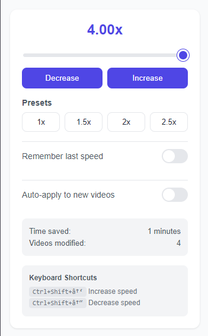

# Video Speed Controller Chrome Extension

A powerful and modern Chrome extension that enhances your video watching experience by providing precise control over video playback speeds across any website.



## Features

### Core Functionality
- 🎮 Precise speed control with slider (0.25x to 4.0x)
- ⚡ Quick speed adjustment buttons
- 🎯 Preset speed buttons (1x, 1.5x, 2x, 2.5x)
- 💾 Speed settings persistence
- 🔄 Auto-apply settings to new videos

### Advanced Features
- ⌨️ Global keyboard shortcuts
  - `Ctrl+Shift+↑`: Increase speed
  - `Ctrl+Shift+↓`: Decrease speed
- 📊 Statistics tracking
  - Time saved by watching at higher speeds
  - Number of videos modified
- 🎯 Per-session video tracking
- 🎨 Modern, clean user interface

## Installation

### From Source
1. Clone this repository or download the ZIP file:
```bash
git clone https://github.com/Sahil-Vernekar16/VideoSpeedControllerChromeExtension.git
```

2. Open Chrome and navigate to `chrome://extensions/`

3. Enable "Developer mode" in the top-right corner

4. Click "Load unpacked" and select the extension directory

### Directory Structure
```
VideoSpeedController/
├── icons/
│   ├── icon16.png
│   ├── icon48.png
│   └── icon128.png
├── manifest.json
├── popup.html
├── popup.js
└── content.js
```

## Usage

1. Click the extension icon in your Chrome toolbar to open the control panel

2. Adjust video speed using any of these methods:
   - Drag the slider
   - Click the Increase/Decrease buttons
   - Use the preset speed buttons
   - Use keyboard shortcuts

3. Optional Settings:
   - Toggle "Remember last speed" to maintain your preferred speed between sessions
   - Enable "Auto-apply to new videos" to automatically set your preferred speed on new videos

## Technical Details

### Built With
- HTML5
- CSS3
- JavaScript
- Chrome Extension APIs

### Browser Compatibility
- Chrome: Version 88 or higher
- Edge: Version 88 or higher (Chromium-based)

## Contributing

1. Fork the repository
2. Create your feature branch: `git checkout -b feature/AmazingFeature`
3. Commit your changes: `git commit -m 'Add some AmazingFeature'`
4. Push to the branch: `git push origin feature/AmazingFeature`
5. Open a Pull Request

## Development

### Local Development
1. Make changes to the source code
2. Go to `chrome://extensions/`
3. Click the refresh icon on your extension
4. Test the changes on any video website

### Building for Production
1. Ensure all files are minified
2. Update version number in `manifest.json`
3. Pack the extension:
   - Go to `chrome://extensions/`
   - Click "Pack extension"
   - Select your extension directory

## License

Distributed under the MIT License. See `LICENSE` for more information.

## Acknowledgments

- Icons designed by Sahil Vernekar
- Inspired by video speed control needs in educational and entertainment contexts
- Thanks to all contributors and users for their feedback and suggestions

## Contact

Your Name - Sahil Vernekar

Project Link: [https://github.com/Sahil-Vernekar16/VideoSpeedControllerChromeExtension.git](https://github.com/Sahil-Vernekar16/VideoSpeedControllerChromeExtension.git)

## Future Updates

- [ ] Per-site speed settings
- [ ] Custom keyboard shortcuts
- [ ] Dark mode support
- [ ] Speed profiles
- [ ] Enhanced statistics and analytics
- [ ] Settings import/export
